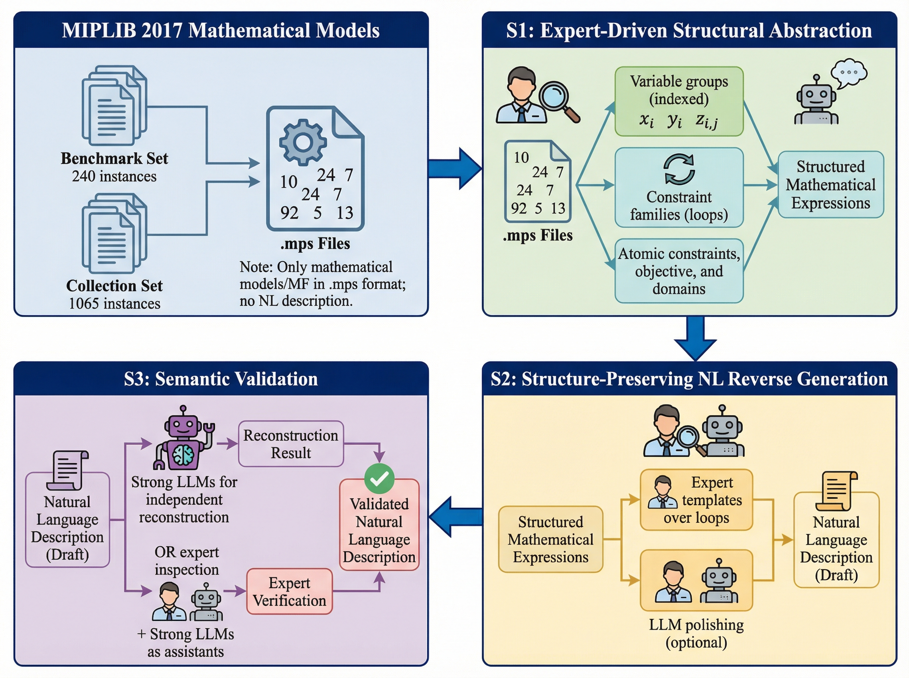
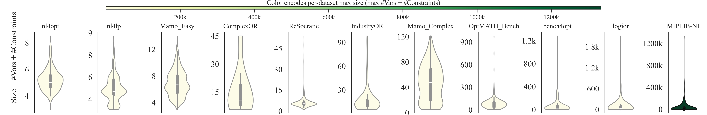
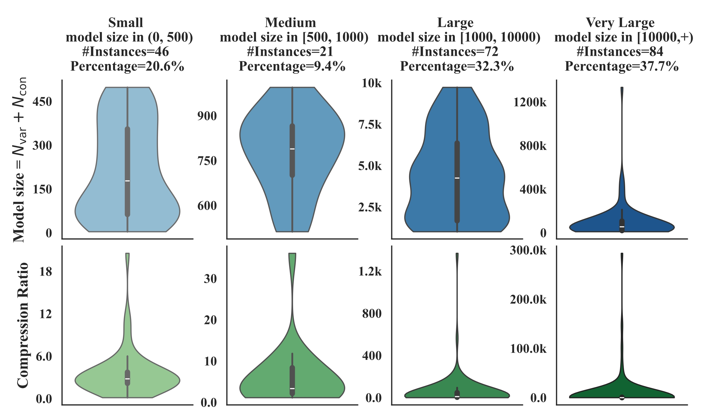
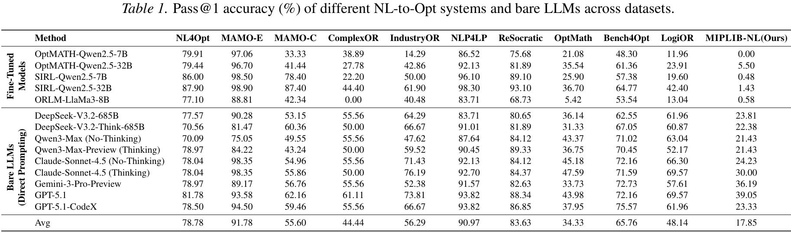

# MIPLIB-NL: Industrial-Scale Natural Language Optimization Modeling Benchmark Based on MIPLIB 2017

## Overview

MIPLIB-NL is a dataset of large-scale natural language optimization problems derived and reverse-engineered from the **MIPLIB 2017** collection, featuring a unique **problem-data separation** format.

We use the following process to create each problem instance:
1. Expert-driven structural abstraction of (often large) MPS files
2. Structure-preserving Opt-to-NL reverse generation via expert-designed blueprints
3. Semantic validation via independent NL-to-Opt reconstruction with human–LLM interaction


*Note: This dataset is currently a preview version; therefore, only the `instance.json` files are displayed in the repository.*

## Key Features
1. A **large-scale** NL-to-Opt benchmark
2. Based on 225 **real-world** MIPLIB 2017 instances
3. **Problem-data separation** format for better scalability and modularity
4. The **most challenging** verified optimization modeling benchmark for LLMs to date

## The Dataset

### Dataset Statistics
- Median number of variables: 2,183 (max 283,648)
- Median number of constraints: 1,388 (max 1,050,112)
- Median compression ratio: 6.5 (max 293,277) — defined as the ratio of the original MPS file size to the combined NL and Data file sizes.

Distribution of problem sizes across optimization benchmarks, measured as the total number of variables plus constraints per instance:


Distribution of model size and compression ratio across scale buckets in the MIPLIB-NL dataset:


### Repository Structure

Each problem instance is presented with a natural language description, a mathematical model, and raw data files, separating the problem logic from the specific instance data.

The core content is located in the `dataset/` directory. Each subdirectory within `dataset/` represents a distinct optimization problem and contains the following files:

```text
dataset/
├── <problem_name>/          # E.g., air03, 30n20b8
│   ├── data/                # Directory containing data files (CSVs)
│   ├── instance.json        # Metadata, problem description, and file schemas
│   ├── model.md             # Mathematical formulation (Markdown)
│   └── solve.py             # Reference Python script to solve the instance (e.g., using Gurobi)
```

### File Descriptions

*   **`data/`**: Detailed data files required to instantiate the problem. These are typically CSV files referenced by `instance.json`.
*   **`instance.json`**: The central metadata file for the problem. It contains the natural language description, parameters, and specifications for input data files.
*   **`model.md`**: A formal mathematical description of the problem, including sets, parameters, decision variables, constraints, and the objective function.
*   **`solve.py`**: An executable Python script that demonstrates how to read `instance.json`, load the data from `data/`, and solve the optimization model using a solver (typically Gurobi).

### `instance.json` Structure

The `instance.json` file serves as the standard definition for each problem. Its fields are defined as follows:

*   **`abstract_problem`**: A comprehensive natural language string describing the background, logic, constraints, and objective of the optimization problem.
*   **`parameters`**: A dictionary of key numerical values defining the scale of the problem (e.g., `{ "n": 100, "m": 50 }`).
*   **`files`**: A dictionary where each key represents a specific data component (e.g., cost inputs, constraint matrices). Each entry contains:
    *   `path`: The relative path to the corresponding file in the `data/` directory.
    *   `description`: A textual description of the file's purpose, including the expected columns and data format.
*   **`optimal_value`**: The objective value of the known best solution for this specific instance.

### Evaluation
Pass@1 accuracy across a range of existing NL-to-Opt benchmarks and MIPLIB-NL, demonstrating the significant increase in difficulty in MIPLIB-NL:


The table below details the Pass@1 accuracy across these benchmarks:


### Citation

If you use this dataset in your research, please cite our paper https://arxiv.org/abs/2602.10450 (BibTeX provided below).
```bibtex
@article{li2026miplibnl,
      title={Constructing Industrial-Scale Optimization Modeling Benchmark}, 
      author={Zhong Li, Hongliang Lu, Tao Wei, Wenyu Liu, Yuxuan Chen, Yuan Lan, Fan Zhang, Zaiwen Wen},
      year={2026},
      eprint={2602.10450},
      archivePrefix={arXiv},
      primaryClass={cs.LG},
      url={https://arxiv.org/abs/2602.10450}, 
}
```


### Contact
We hope that the dataset is useful for your research or application. If you have any bug reports or comments, please feel free to email one of the authors:
- Zhong Li, [zhongli at gbu.edu.cn](mailto:zhongli@gbu.edu.cn)
- Hongliang Lu, [lhl at pku.edu.cn](mailto:lhl@pku.edu.cn)
- Tao Wei, [weit at pku.edu.cn](mailto:weit@pku.edu.cn)
- Zaiwen Wen, [wenzw at pku.edu.cn](mailto:wenzw@pku.edu.cn)
