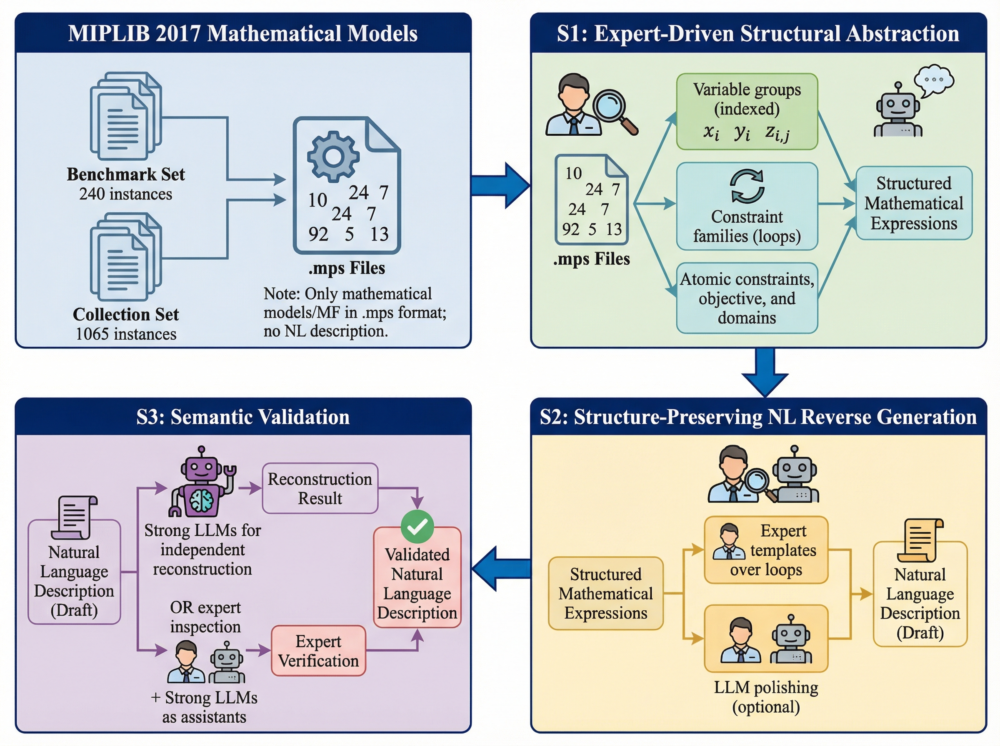
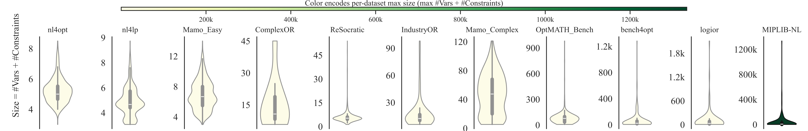
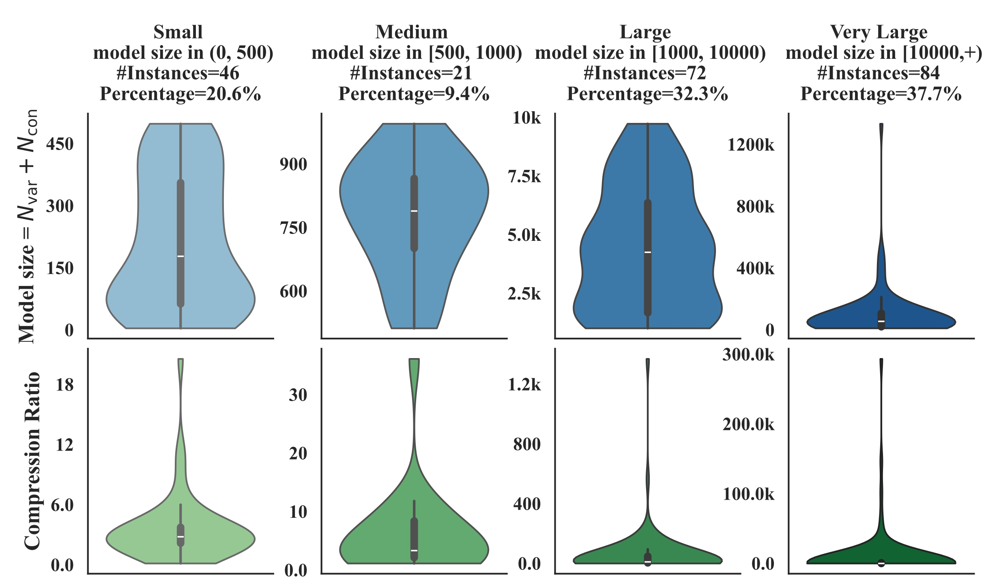
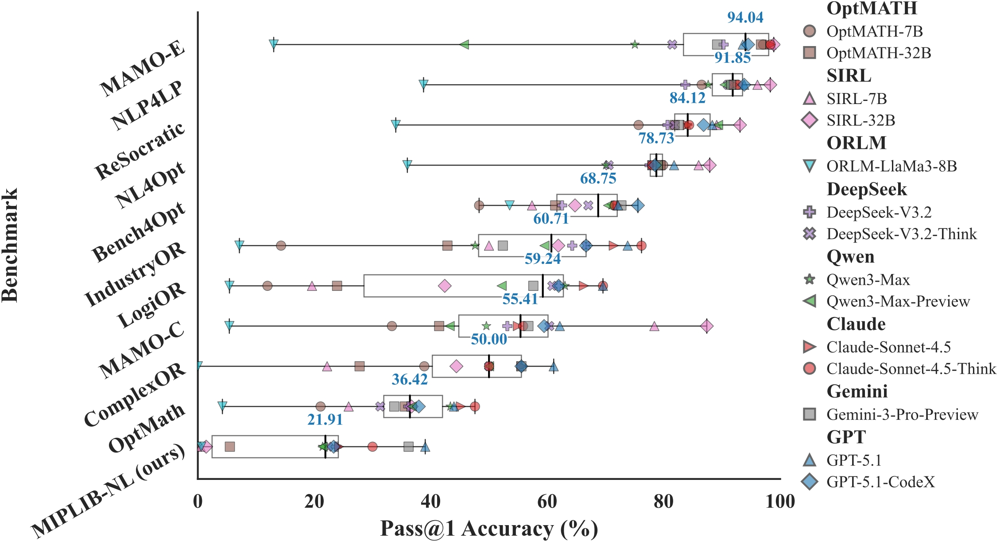
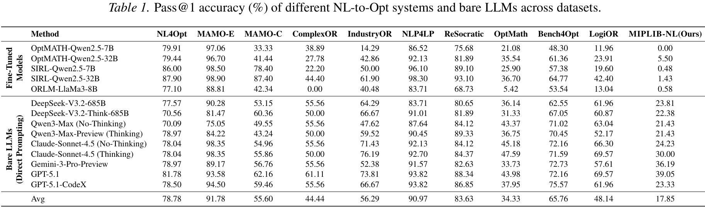

# MIPLIB-NL: Industrial-Scale Natural Language Optimization Modeling Benchmark

[](https://openreview.net/forum?id=0Q7adIsv6p)
[](https://openreview.net/forum?id=0Q7adIsv6p)
[](https://creativecommons.org/licenses/by-sa/4.0/)
[](https://visitorbadge.io/status?path=zlifr%2FMIPLIB-NL)

This repository accompanies our **ICML 2026** paper:

> **Constructing Industrial-Scale Optimization Modeling Benchmark**  
> Zhong Li*, Hongliang Lu*, Tao Wei*, Yuxuan Chen*, Wenyu Liu, Yuan Lan, Fan Zhang, Zaiwen Wen  
> \* Equal contribution

MIPLIB-NL is an **industrial-scale natural-language-to-optimization (NL-to-Opt) benchmark** reverse-constructed from **MIPLIB 2017**. It is designed to evaluate whether large language models can translate natural-language requirements into **correct optimization formulations** and **solver-executable code** under realistic industrial-scale structure.

Unlike prior toy-scale or synthetic benchmarks, MIPLIB-NL preserves **large-scale structure**, **model--data alignment**, and **solver-grounded verifiability** through a **problem--data separation** format.

---

## News

- **[May 2026]** MIPLIB-NL is accepted at **ICML 2026**.
- **[May 2026]** OpenReview page: [0Q7adIsv6p](https://openreview.net/forum?id=0Q7adIsv6p)
- **[Feb 2026]** arXiv version released: [arXiv:2602.10450](https://arxiv.org/abs/2602.10450)

---

## Overview

We construct each benchmark instance through a three-stage, structure-aware reverse-construction pipeline:

1. **Structural abstraction** of large solver-level formulations (e.g., MPS files)
2. **Structure-preserving Opt-to-NL reverse generation** using expert-designed blueprints
3. **Semantic validation** via independent NL-to-Opt reconstruction with human--LLM interaction



This pipeline yields **223 verified one-to-one reconstructions** from MIPLIB 2017.

---

## Highlights

- **Industrial-scale benchmark** for NL-to-Opt evaluation
- **223 verified instances** reverse-constructed from **MIPLIB 2017**
- **Problem--data separation** format for scalability, modularity, and auditability
- **Solver-grounded validation** for faithful benchmark construction
- Designed to expose **failure modes invisible on toy-scale benchmarks**

---

## Dataset at a Glance

### Scale Statistics

- **Median number of variables:** 2,183
- **Maximum number of variables:** 283,648
- **Median number of constraints:** 1,388
- **Maximum number of constraints:** 1,050,112
- **Median compression ratio:** 6.5
- **Maximum compression ratio:** 293,277

Here, the **compression ratio** is defined as:

> original MPS file size / (NL description size + data file sizes)

### Benchmark Scale Compared with Prior Work

Distribution of problem sizes across optimization benchmarks, measured as  
**#variables + #constraints** per instance:



Distribution of model size and compression ratio across scale buckets in MIPLIB-NL:



---

## Why MIPLIB-NL?

Optimization modeling is central to decision-making in logistics, manufacturing, energy, and finance. However, translating natural-language problem descriptions into **correct optimization models** remains highly challenging.

Existing NL-to-Opt benchmarks are often:

- too small,
- too synthetic,
- or too weak in preserving realistic industrial structure.

MIPLIB-NL is designed to fill this gap by providing a benchmark that is:

- **large-scale**
- **structure-preserving**
- **solver-grounded**
- **auditable**
- and **directly executable**

Our experiments show that methods that appear strong on existing benchmarks can degrade sharply on MIPLIB-NL, revealing a substantially different capability regime.

---

## Repository Structure

Each instance is released with:

- a **natural language problem description**
- a **formal mathematical model**
- and **raw data files**

The core content lives in the `dataset/` directory:

```text
dataset/
├── <problem_name>/          # e.g., air03, 30n20b8
│   ├── data/                # Data files (typically CSVs)
│   ├── instance.json        # Metadata, NL description, and file schemas
│   ├── model.md             # Mathematical formulation
│   └── solve.py             # Reference solver script (typically Gurobi-based)
```

---

## Instance Format

### `data/`

Contains the raw data files required to instantiate the optimization problem. These are typically CSV files referenced by `instance.json`.

### `instance.json`

The central metadata file for each instance. It includes:

- **`abstract_problem`**: the natural-language problem description
- **`parameters`**: key instance-level numerical parameters
- **`files`**: schema and description for each data file
- **`optimal_value`**: the reference optimal objective value

### `model.md`

A structured mathematical formulation including:

- sets
- parameters
- decision variables
- constraints
- objective

### `solve.py`

A reference Python script that reads `instance.json`, loads `data/`, and solves the instance using a solver (typically **Gurobi**).

---

## `instance.json` Schema

Each `instance.json` contains the following key fields:

- **`abstract_problem`**  
  A detailed natural-language description of the problem background, decision logic, constraints, and objective.

- **`parameters`**  
  A dictionary of key scalar parameters defining the instance scale, e.g.
  ```json
  { "n": 100, "m": 50 }
  ```

- **`files`**  
  A dictionary describing each data component. Each entry contains:
  - `path`: relative path to the corresponding file under `data/`
  - `description`: description of its role, expected columns, and format

- **`optimal_value`**  
  The reference best-known objective value for the instance.

---

## Validation

A key design goal of MIPLIB-NL is **verifiability**.

Each retained instance is checked through a semantic validation pipeline that includes:

- **independent NL-to-Opt reconstruction**
- **expert review**
- **human--LLM interaction**
- **solver-grounded consistency checks**

This makes MIPLIB-NL more than a collection of prompts: it is a **verified benchmark** with explicit links between natural language, structured data, mathematical formulation, and executable reference solutions.

---

## Evaluation

### Pass@1 Performance Across Benchmarks

Pass@1 accuracy across prior NL-to-Opt benchmarks and MIPLIB-NL:



Detailed accuracy table:



These results highlight the substantial difficulty gap between prior benchmarks and MIPLIB-NL.

---

## Scope

This release focuses on **mixed-integer linear programming (MILP)** instances reverse-constructed from **MIPLIB 2017**.

While the current benchmark is MILP-based, the reverse-construction methodology is more general. Extending the pipeline to broader optimization families (e.g., nonlinear, conic, semidefinite, or multi-objective settings) is an important direction for future work.

---

## Citation

If you find MIPLIB-NL useful in your research, please cite:

```bibtex
@inproceedings{li2026constructing,
  title={Constructing Industrial-Scale Optimization Modeling Benchmark},
  author={
    Li, Zhong and
    Lu, Hongliang and
    Wei, Tao and
    Chen, Yuxuan and
    Liu, Wenyu and
    Lan, Yuan and
    Zhang, Fan and
    Wen, Zaiwen
  },
  booktitle={Forty-third International Conference on Machine Learning},
  year={2026},
  url={https://openreview.net/forum?id=0Q7adIsv6p}
}
```

---

## License

This repository is released under the **CC BY-SA 4.0** license.

---

## Contact

We hope this benchmark is useful for your research.  
For bug reports, questions, or suggestions, please contact:

- Zhong Li — [zhongli@gbu.edu.cn](mailto:zhongli@gbu.edu.cn)
- Hongliang Lu — [lhl@pku.edu.cn](mailto:lhl@pku.edu.cn)
- Tao Wei — [weit@pku.edu.cn](mailto:weit@pku.edu.cn)
- Zaiwen Wen — [wenzw@pku.edu.cn](mailto:wenzw@pku.edu.cn)
